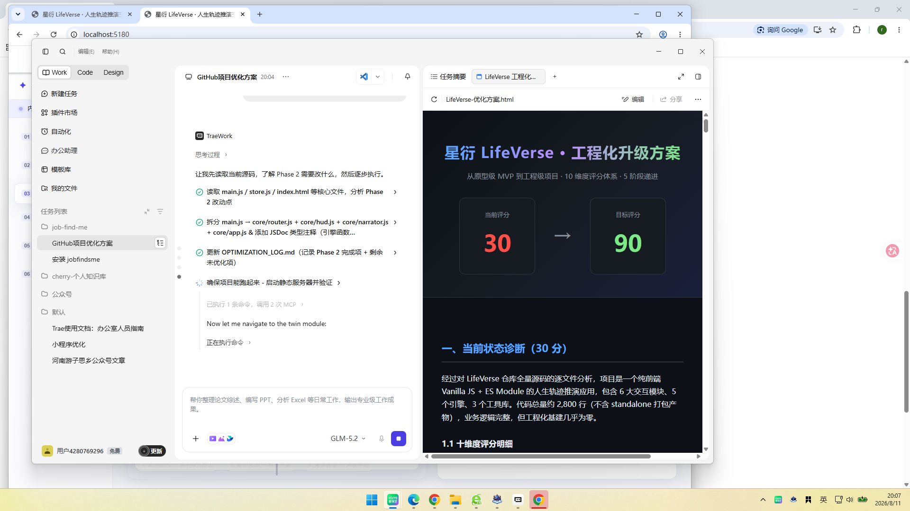
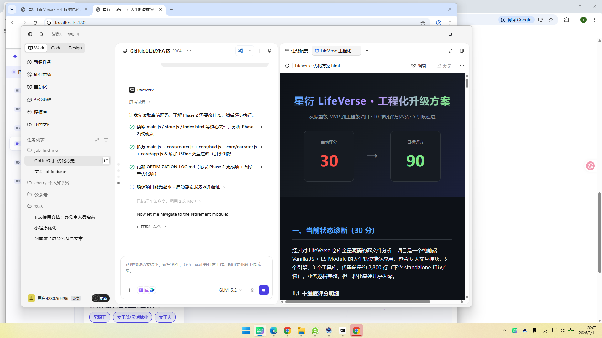

# 星衍 LifeVerse · 人生轨迹推演空间

纯前端可运行项目（原生 Vanilla + ES Module，零运行时依赖）。从一份人生推演 PRD 抽出核心引擎，做成一个可交互、可持久化、6 大模块端到端联动的网页应用。

## 快速开始

```bash
npm start
# 或： node server.js
```

浏览器打开 `http://localhost:5173`（ES Module 必须经 http 提供，不能直接双击 index.html）。

> 也可以用任意静态服务器，例如 `python -m http.server 5173`。

### 离线单文件版（无需服务器）

`星衍LifeVerse-standalone.html` 是一个自包含单文件（16 个模块打包为单 IIFE + 内联 CSS），可直接双击用浏览器打开离线运行，适合分享与演示。改完源码后执行 `npm run build:standalone` 可重新生成。

## 模块地图

| 模块 | 文件 | 说明 |
|------|------|------|
| 01 混沌星云注入 | `js/modules/nebula.js` | 简历质能坍缩凝聚主星体，写入用户画像 |
| 02/07/08 星图宇宙·关系引力场 | `js/modules/starmapView.js` | 11 节点 BFS 涟漪传导 + 阻尼反弹波 |
| 03 双生时空剪影 | `js/modules/twin.js` | 跨时空共振光束 + 结构相似度向量矩阵 |
| 04 退休时钟 | `js/modules/retirement.js` | 渐进式延迟退休真实算法 |
| 05 光阴探针 & 平行宇宙撕裂 | `js/modules/probe.js` | 年份拖动轨道扩张 + A/B 双轨对比 |
| 06 个人断代史报告 | `js/modules/report.js` | 聚合前序所有数据，一页可打印报告 |

## 项目截图

| 模块 | 截图 |
|------|------|
| 01 混沌星云注入 |  |
| 02 星图宇宙·关系引力场 |  |
| 03 双生时空剪影 |  |
| 04 退休时钟 |  |
| 05 光阴探针 & 平行宇宙撕裂 |  |
| 06 个人断代史报告 |  |

## 项目架构

```
星衍LifeVerse/
├── js/
│   ├── core/               # 6 个核心子系统
│   │   ├── router.js        # 模块注册表 + 路由切换
│   │   ├── hud.js           # HUD 徽章 + 人生完整度环
│   │   ├── narrator.js      # 叙事条 + 时代广播
│   │   ├── bgStarNet.js     # 背景星网粒子动画
│   │   ├── interactions.js  # 音效面板 + 快捷键 + 语音
│   │   ├── errorBoundary.js # 全局错误捕获
│   │   └── app.js           # 应用单例（替代 window.LTApp）
│   ├── engines/             # 核心引擎（5 个，均有单元测试）
│   │   ├── retirement.js    # 退休算法
│   │   ├── starmap.js       # BFS 涟漪传导
│   │   ├── rulebase.js      # 传导规则库
│   │   ├── vectorMatrix.js  # 余弦相似度
│   │   ├── audio.js         # Web Audio 音效
│   │   └── index.js         # Barrel export
│   ├── modules/             # 6 个 UI 模块
│   ├── utils/               # 工具函数（math/dom/canvas/sanitize）
│   ├── store.js             # 状态管理 + schema 校验
│   └── main.js              # 薄入口
├── tests/unit/              # Vitest 单元测试（6 个文件）
├── scripts/build-standalone.mjs  # 零依赖打包脚本
├── docs/                    # PRD 文档
├── css/                     # 样式 + a11y.css 可访问性增强
├── vite.config.js           # Vite 构建
├── vitest.config.js         # 测试配置
├── eslint.config.js         # ESLint Flat Config
└── package.json
```

## 核心引擎（`js/engines/`）

- `retirement.js` —— `delayMonths` / `minPayYears` / `computeRetirement`，边界与政策一致（男封顶 63 / 女55档 58 / 女50档 55；退休≥2040 最低缴费跃迁 20 年）。
- `starmap.js` —— `castRipple` BFS 引擎，`DECAY=[1,0.7,0.4,0.15]`，`resistance≥0.5` 时 `nextImpact *= (1 - resistance*0.6)`。
- `rulebase.js` —— 传导规则库 Schema + 效应文案。
- `vectorMatrix.js` —— 三维结构向量余弦相似度，实时匹配唐/宋/明历史周期。
- `audio.js` —— Web Audio 音效引擎（连接/涟漪/反弹）+ 一键静音，localStorage 持久化。

## 数据流

`星云注入 → 退休预填 → 星图涟漪 → 双生共振 → 断代史报告`，全程经 `js/store.js`（localStorage）联动，刷新不丢失。

## 工程化

- **测试**：Vitest + jsdom，覆盖 5 个引擎模块 + 工具层
- **构建**：Vite（HMR + 生产构建）+ 零依赖 standalone 打包
- **规范**：ESLint Flat Config + Prettier + Husky pre-commit
- **安全**：report.js / starmapView.js 动态文本经 `escapeHtml` 转义；`server.js` 输出 CSP 头
- **健壮性**：全局错误边界 + store schema 校验 + 背景动画 `visibilitychange` 暂停

优化记录见 [OPTIMIZATION_LOG.md](OPTIMIZATION_LOG.md)。

## 已知工程化缺口（待办）

1. 模块懒加载（首屏全量加载，未做动态 import）
2. E2E 测试 / PWA / 性能监控埋点

完整待办清单见 [OPTIMIZATION_LOG.md](OPTIMIZATION_LOG.md) 未优化项详情。

## 许可与版权

个人作品集 / 技术演示项目（Portfolio Demo），非商业产品。保留所有权利，未经书面授权不得用于商业目的。
