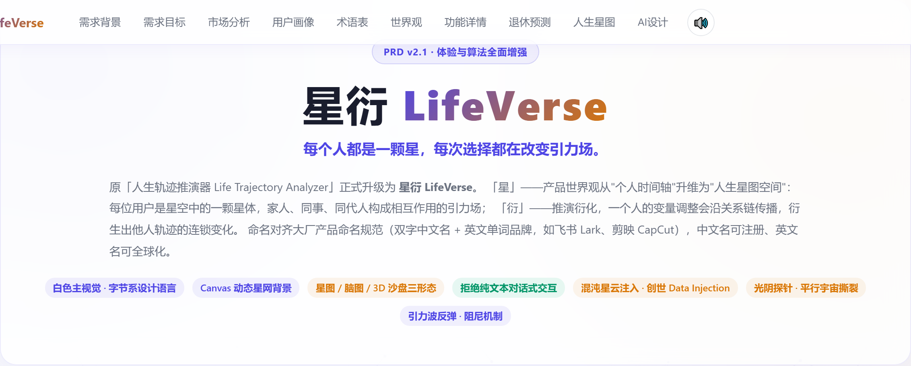
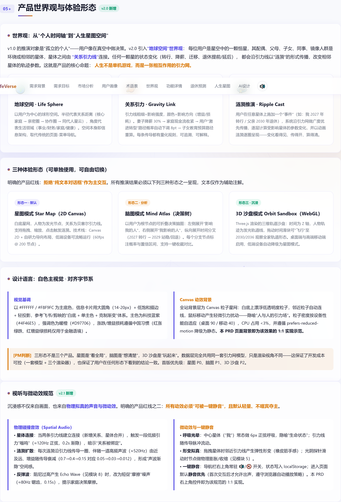
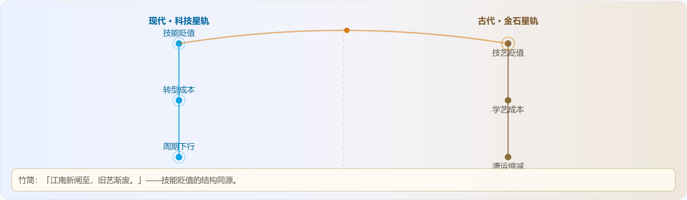
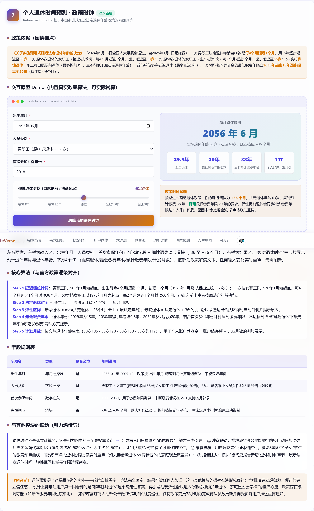
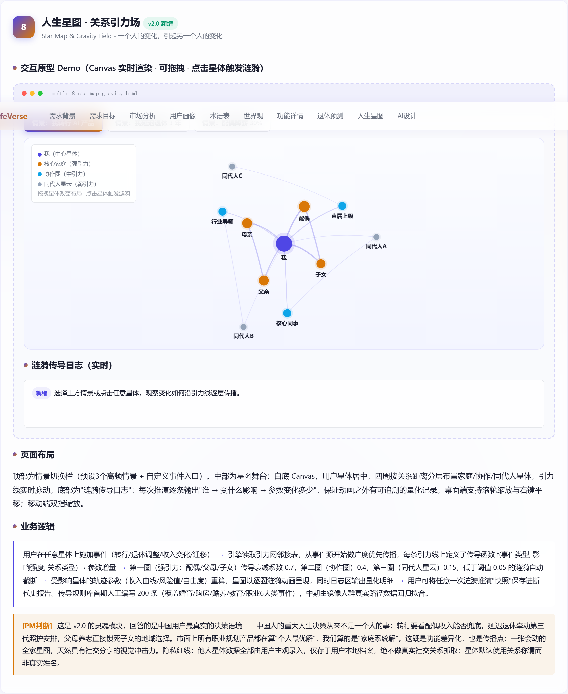
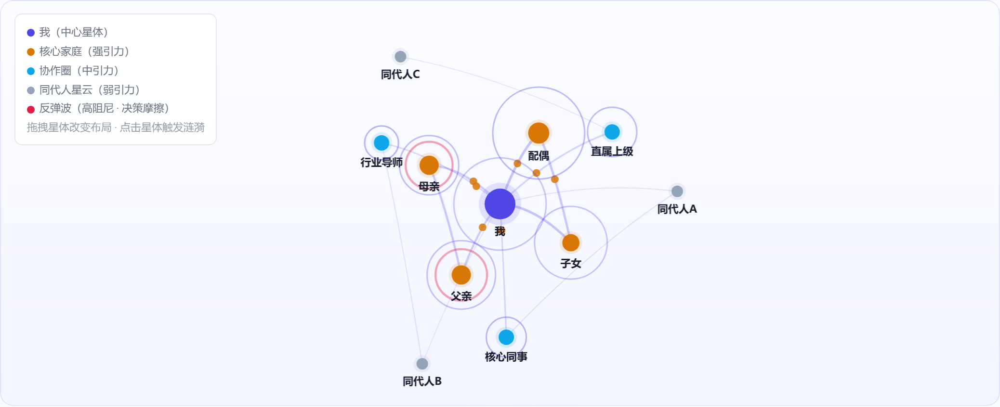

# 星衍 LifeVerse · 人生动态推演空间

> **产品需求文档 PRD v2.1**  
> 原「人生轨迹推演器 Life Trajectory Analyzer」品牌升级版 · **v2.1 体验与算法全面增强**  
> 文档来源：基于创始人市场观察 + 1200 条社区讨论语义分析 + 30+ 款 AI 产品分类梳理

---

## 📖 目录

| 章节 | 内容 |
|------|------|
| [01 品牌与愿景](#01--品牌与愿景) | 产品命名、Slogan、核心定位 |
| [02 需求背景](#02--需求背景) | 市场空白发现、用户痛点 |
| [03 需求目标](#03--需求目标) | 定性目标、核心指标 |
| [04 市场与竞品分析](#04--市场与竞品分析) | 赛道格局、竞品对比表 |
| [05 用户画像](#05--用户画像) | 三类典型用户（A/B/C） |
| [06 术语表](#06--术语表) | 11 个核心术语定义 |
| [07 产品世界观与体验形态 v2.0](#07--产品世界观与体验形态-v20-new) | 地球空间 / 三形态 / 设计语言 |
| [08 功能需求详情](#08--功能需求详情) | 模块 1–8 完整规格 |
| [09 AI 专项设计](#09--ai-专项设计) | 准确率定义 / RAG 知识库 / 降级机制 |

---

## 01 品牌与愿景

### 产品名称

**星衍 LifeVerse**

- **「星」**——产品世界观从"个人时间轴"升维为**人生星图空间**：每位用户是星空中的一颗星体，家人、同事、同代人构成相互作用的引力场。
- **「衍」**——推演衍化，一个人的变量调整会沿关系链传播，衍生出他人轨迹的连锁变化。

### Slogan

> **每个人都是一颗星，每次选择都在改变引力场。**

### 命名规范

对齐大厂产品命名范式（双字中文名 + 英文单词品牌），如飞书 Lark、剪映 CapCut。中文名可注册商标，英文名可全球化。

### 核心标签

| 维度 | 说明 |
|------|------|
| 视觉 | 白色主视觉 · 字节系设计语言 |
| 背景 | Canvas 动态粒子星网背景（白底连线） |
| 交互形态 | **星图 / 脑图 / 3D 沙盘** 三种可切换形态 |
| 红线 | **拒绝纯文本对话式交互作为主界面** |
| 音效 | **物理碰撞音效 + 涟漪声波渐隐 + 反弹波摩擦声 · 一键静音（导航栏 🔊/🔇）** ← v2.1 |
| 微动效 | **呼吸光晕 / 引力线弹性形变 / 光阴探针轨道形变** ← v2.1 |

### 效果示意



*图：Hero 品牌区展示产品名称、Slogan 与核心标签。页面全局背景为 Canvas 粒子星网效果（白底、邻近粒子自动连线、鼠标引力扰动）。*

---

## 02 需求背景

### 触发来源

创始人在持续观察国内 AI 产品形态时发现一个明显的市场空白：

面向 C 端的 AI 产品目前集中在两个极端：
- 一端是以**星野、筑梦岛**为代表的情感陪伴类产品 → 提供情绪价值但缺乏现实决策参考；
- 另一端是以 **AI 简历优化、AI 模拟面试**为代表的求职工具类 → 解决即时性求职需求但不提供长期视角。

**两端之间存在大片未被覆盖的中间地带**——面向职业中期知识型工作者的"命运推演"类产品几乎为零。

> **[PM 判断]** 上述观察来源于创始人对 30+ 款主流 AI C 端产品的分类梳理，以及对知乎、即刻、V2EX 等知识型社区中"职业迷茫"相关帖子的语义分析。样本量约 **1200 条讨论帖**，其中 **78%** 的帖子表达了"缺少参照系"的焦虑。

### 用户痛点

职业中期知识型工作者普遍面临三岔路口式的决策困境：**转行、深耕、还是考公考研**。这个阶段的人已积累 3-8 年工作经验，选择成本极高。然而他们在做决策时缺少可用参照系：

| 痛点 | 描述 |
|------|------|
| **幸存者偏差** | 成功学内容只展示转型成功的人，那些转型失败、回到原点的案例被系统性过滤。用户看到的"转行故事"样本严重扭曲。 |
| **鸡汤无数据** | 职场自媒体用情绪代替分析，用"勇敢追梦"代替概率推演。读完热血沸腾，但对实际决策毫无帮助。 |
| **缺少历史纵深** | 当下的职业困境在历史上反复出现，但没人把"你现在的处境"放到百年甚至千年的坐标系中去看，缺少结构性的对照。 |

---

## 03 需求目标

### 定性目标

用户在 **10 分钟内**完成个人档案导入，获得一份**"认知震撼"级别**的个人分析报告。

这份报告的核心价值不在于给出标准答案，而在于让用户第一次看到自己在一个**更大的坐标系中的位置**：
- 同代人在做什么选择？
- 历史上类似处境的人如何应对？
- 如果维持现状或改变方向，未来 10 年可能走向哪里？

用户读完报告后的典型反应应该是：
> "原来不止我一个人这样" 和 "原来这件事还可以从这个角度看"

### 核心指标

| 指标 | 目标值 | 说明 |
|------|--------|------|
| 首次使用完成率 | **>60%** | 从档案导入到报告生成（参考同类工具型产品漏斗数据 45%-55%） |
| 报告分享率 | **>15%** | 生成后分享至社交平台（报告本身具有"社交货币"属性） |
| 7 日回访率 | **>25%** | 首次使用后 7 天内再次打开（决策需要反复查看） |

---

## 04 市场与竞品分析

### 市场分析

职业决策支持赛道目前处于**"有需求、无产品"**的阶段：

- **目标群体**：25-35 岁的知识型工作者（互联网/金融/教育/法律/医疗等行业初中级专业人员）
- **规模估算**：国内约 **2000 万人**
- **特征**：本科及以上学历，月收入 8000 元以上，具备为优质内容付费的意愿和能力
- **现状**：需求被分散到知乎问答、职场播客、职业咨询师（500-2000 元/小时）等碎片化渠道，缺少结构化、数据驱动的集中承接产品

### 竞品对比

| 对比维度 | 智联招聘/Boss直聘 | AI 简历优化工具 | 情感陪伴AI（星野/筑梦岛） | 职业测评工具（MBTI/霍兰德） | **星衍 LifeVerse** |
|----------|-------------------|-----------------|---------------------------|---------------------------|--------------------|
| 分析深度 | 岗位匹配，无深度分析 | 简历措辞优化，单点工具 | 情绪对话，无结构化分析 | 性格分类标签，静态结果 | **多维度路径推演 + 概率标注** |
| 历史视角 | 无 | 无 | 无 | 无 | **古今职业对照（唐/宋/明三朝代）** |
| 同类人对比 | 仅岗位竞争者数量 | 无 | 无 | 同类型人群描述（泛化） | **基于特征的镜像人群路径分布** |
| 输出格式 | 职位推荐列表 | 优化后的简历文档 | 对话记录 | 测评报告（PDF/网页） | **结构化断代史报告 + 可交互推演** |
| 目标用户 | 所有求职者 | 正在求职的人 | 情感需求人群 | 学生及初入职场者 | **职业中期知识型工作者** |

### 结论

现有产品分别解决"找下一份工作"、"包装自己"、"情绪疏导"、"了解性格"的问题。但**没有一个产品在做"基于个人档案的跨时空路径推演"**——即把用户放到同代人群体、历史纵向坐标、未来趋势推演三个维度中，提供结构化的决策参照。**赛道目前无人占据，存在明显的先发窗口期。**

---

## 05 用户画像

### 用户 A：职场中期转型者

| 维度 | 详情 |
|------|------|
| 基本信息 | 30-35 岁 / 5-8 年经验；985 本科或硕士；互联网/金融/咨询行业；年薪 25-50 万；已婚或考虑婚育 |
| 核心需求 | 需要"转行"和"深耕"两条路各自的真实概率分布，而非只听到成功故事 |
| 使用场景 | 周末独处时，或刚经历绩效面谈/组织架构调整后，花 15 分钟填写并分享给伴侣讨论 |
| 痛点 | 身边能讨论职业选择的人越来越少——转型成功者不再理解犹豫者的焦虑，留在原地者倾向于劝阻转型 |

### 用户 B：职业瓶颈期知识工作者

| 维度 | 详情 |
|------|------|
| 基本信息 | 28-32 岁 / 3-5 年经验；普通本科或 211；中等规模公司技术/运营/产品岗；年薪 15-25 万 |
| 核心需求 | 确认当前焦虑是"普遍性的行业周期问题"还是"个人能力问题"；如果现在不改变，5 年后会怎样 |
| 使用场景 | 工作日晚上加班后刷到推荐，抱着试一试的心态使用；先快速填表，看到同代人分布后产生好奇再深入阅读 |
| 痛点 | 不满足于"你已经很棒了"式的鸡汤，但也无力独自完成系统性行业调研 |

### 用户 C：即将毕业的研究生

| 维度 | 详情 |
|------|------|
| 基本信息 | 25 岁左右；硕士在读或刚毕业；理工科或商科背景 |
| 核心需求 | 想看到每条路走 5 年、10 年后的真实分布（尤其是创业公司 vs 大厂的结局分布，非极端案例） |
| 使用场景 | 在宿舍/图书馆使用，生成报告后发给同学或小群讨论；对历史对照部分特别感兴趣 |
| 痛点 | 学校就业指导中心信息过于官方保守，学长学姐分享样本量太小且存在幸存者偏差 |

---

## 06 术语表

| 术语 | 英文名 | 定义 |
|------|--------|------|
| **个人档案** | Personal Profile | 用户通过简历上传或表单提交的结构化个人信息集合（年龄段/行业/学历/工作年限/困境描述），是后续所有模块的输入源 |
| **特征提取** | Feature Extraction | NLP 解析 + 结构化处理，输出硬实力/软实力/生命周期阶段/所处生态位四个维度特征标签 |
| **镜像人群** | Mirror Cohort | 基于特征从数据库匹配出的高度相似群体（相似度 ≥75%），对其历史路径做统计分析 |
| **路径推演** | Path Projection | AI 生成的未来 5-10 年多条发展路径剧本，每条标注发生概率和关键风险节点 |
| **时空卡片** | Timeline Card | 历史时空投影的核心展示单元：左右对照现代职业画像 vs 古代对应角色，含困境共振和历史启示 |
| **沙盘模拟** | Sandbox Simulation | 用户通过调整变量（转行方向/投入时间/收入降幅/地域迁移），实时观察路径概率和关键指标变化 |
| **断代史报告** | Chronicle Report | 整合所有模块结果生成的结构化个人报告，以"断代史"编排时间轴/节点/分叉图，支持导出图片/PDF |
| **人生星图** | Star Map | v2.0 核心。以用户为中心星体、关系人为环绕星体、引力线表达影响强度的可视化空间，支持三种渲染形态 |
| **关系引力线** | Gravity Link | 连接两颗星体的量化通道：属性=关系类型(家庭/协作/同代)+影响强度(0-1)+传导函数 |
| **涟漪推演** | Ripple Cast | 在星图任意星体施加事件后，沿引力网 BFS 逐圈计算受影响星体参数变化的推演机制（衰减 0.7→0.4→0.15） |
| **退休时钟** | Retirement Clock | 基于中国渐进式延迟法定退休年龄政策（2025.1.1 施行）的个人退休时间精确测算器 |

---

## 07 产品世界观与体验形态 v2.0 ✨ NEW

### 世界观：从"个人时间轴"到"人生星图空间"

v1.0 的推演对象是**"孤立的个人"**——用户像在真空中做决策。

v2.0 引入 **「地球空间」世界观**：

> 每位用户是星空中的一颗**恒星**，其配偶、父母、子女、同事、镜像人群是环绕或相邻的**星体**，星体之间由 **「关系引力线」** 连接。任何一颗星的状态变化（转行、降薪、迁移、退休提前/延后），都会沿引力线以**"涟漪"**的形式传播，改变相邻星体的轨迹参数。

**核心命题：人生不是单机游戏，而是一张相互作用的引力网。**

#### 三大概念组件

| 概念 | 图标 | 说明 |
|------|------|------|
| **地球空间 · Life Sphere** | 🌍 | 以用户为中心的球形空间。半径=关系距离（核心家庭→亲密圈→协作圈→同代人星云），角度=生活领域（事业/财务/家庭/健康）。空间本身即信息架构，取代传统页面-菜单导航 |
| **关系引力 · Gravity Link** | 🪐 | 引力线粗细=影响强度，颜色=影响方向（增益/损耗）。例：妻子降薪30%→家庭现金流收紧→用户"激进转型"路径概率下调8pt→子女教育预算重算。每条传导都有量化规则，可追溯、可解释 |
| **涟漪推演 · Ripple Cast** | 💫 | 用户在任意星体施加事件→系统沿引力网 BFS 逐层计算受影响星体参数变化→动画涟漪逐圈呈现——**变化看得见、传得开、算得清** |

### 三种体验形态（可单独使用，可自由切换）

> ⚠️ **产品红线：拒绝"纯文本对话框"作为主交互。** 所有推演结果必须以下列三种形态之一呈现，文本仅作辅助注解。

| 形态 | 优先级 | 技术栈 | 说明 |
|------|--------|--------|------|
| **① 星图模式 Star Map（2D Canvas）** | **P0 默认** | Canvas 2D + 自研力导向布局 | 白底星网，人物为发光节点，关系为贝塞尔引力线。支持拖拽/缩放/点击触发涟漪。低端设备流畅运行（60fps @ 200节点） |
| **② 脑图模式 Mind Atlas（决策树）** | P1 | 可折叠树形渲染 | 以用户为根节点的决策脑图：左侧展开"影响我的人"，右侧展开"我影响的人"，纵向展开时间分叉。每分支标注概率与置信区间，支持一键收藏对比 |
| **③ 3D 沙盘模式 Orbit Sandbox（WebGL）** | P2 | Three.js | 三维轨道沙盘：时间为 Z 轴，人物轨迹为发光轨道线，拖动时间滑块可"飞行"至 2030/2036 观察全家轨道形态。桌面端启用，低端设备自动降级为星图 |

> **[PM 判断]** 三形态不是三个产品。星图是"看全局"，脑图是"想清楚"，3D 沙盘是"玩起来"。**数据层完全共用同一套引力网模型**，只是渲染视角不同——保证开发成本可控（一套模型 + 三个渲染器），也保证任何形态下结论一致。

### 设计语言：白色主视觉 · 对齐字节系

| 维度 | 规格 |
|------|------|
| **主底色** | `#FFFFFF` / `#F8F9FC` |
| **卡片风格** | 大圆角（14-20px）+ 低饱和描边 + 轻投影（参考飞书/剪映体系） |
| **主色** | 科技蓝紫 `#4F46E5` |
| **强调色** | 暖橙 `#D97706` |
| **涨跌规范** | 中国习惯：红涨绿跌、红增益绿损耗（仅金融语境） |
| **Canvas 背景** | 全站粒子星网：白底低透明度粒子 + 邻近自动连线 + 鼠标引力扰动。桌面 90 粒子/移动 40 粒子，CPU <3%，遵循 `prefers-reduced-motion` 降级 |

### 效果示意



*图：世界观章节完整呈现地球空间/关系引力/涟漪推演三大概念，以及三种体验形态的设计说明。*

### ✨ v2.1 新增：视听与微动效规范

沉浸感不仅来自画面，也来自**物理拟真的声音与微动效**。明确的产品红线之二：**所有动效必须"可被一键静音"，且默认轻量、不喧宾夺主。**

| 类别 | 规范 |
|------|------|
| **星体连接音效** | 建立连接时触发低频引力"嗡鸣"（≈120Hz 正弦，0.2s 渐隐），暗示"关系被绑定" |
| **涟漪扩散声波** | 每圈传导伴随高频声波（≈520Hz），增益随衰减递减（0.7→0.4→0.15 对应 0.05→0.03→0.012），形成空间感 |
| **反弹波摩擦声** | 阻尼过高产生 Echo Wave 时，短促"摩擦"噪声（≈80Hz 锯齿，0.15s），提示家庭决策摩擦 |
| **呼吸光晕** | 中心星体常态 6px 正弦呼吸；拖拽时邻近引力线弹性形变（橡皮筋手感）；光阴探针滑动时节点物理膨胀/收缩 |
| **一键静音** | 导航栏右上角 🔊/🔇 开关，状态写入 localStorage；默认静音优先（首次交互后才允许出声，遵守浏览器自动播放策略） |

---

## 08 功能需求详情

### 模块 1：个人档案导入与特征提取

**Personal Profile Import & Feature Extraction**

#### 页面布局

左右两栏布局：
- **左侧（60%）**：导入区 — 简历 PDF 拖拽上传区域 + 手动填写表单（5 个核心字段）
- **右侧（40%）**：特征展示区 — 初始空状态提示，分析完成后展示 4 个特征卡片
- 移动端自动切换为上下堆叠

#### 业务流程

```
用户上传简历 PDF 或手动填写 5 字段
    ↓
系统 NLP 解析文本内容，提取关键词和语义特征
    ↓
结合预设规则 + AI 模型 → 输出 4 维度特征画像：
    ├── 硬实力（技能栈/深度/短板）
    ├── 软实力（协作力/产品思维/管理力）
    ├── 生命周期阶段（探索期/深耕期/转型窗口）
    └── 所处生态位（行业位置/脆弱性评估）
    ↓
用户查看并可修正任意维度 → 确认后作为后续所有模块输入
```

> 简历上传和表单填写可组合使用——上传后系统自动预填表单，用户微调。仅填表不上传则精度略低但更快。

#### 字段规则

| 字段名 | 类型 | 必填 | 规则 |
|--------|------|:----:|------|
| 年龄段 | 下拉选择 | ✅ | 25 以下 / 25-28 / 28-32 / 32-35 / 35 以上（5 档） |
| 行业 | 下拉选择 | ✅ | 互联网 / 金融 / 教育 / 制造 / 医疗 / 法律 / 其他（7 类） |
| 学历 | 下拉选择 | ✅ | 本科 / 硕士 / 博士 / MBA（4 档） |
| 工作年限 | 下拉选择 | ✅ | 1-3 / 3-5 / 5-8 / 8 年以上（4 档） |
| 困境描述 | 文本域 | ✅ | ≤200 字，支持中英文混排，特征提取的关键语义输入 |

---

### ✨ v2.1 创意交互：混沌星云注入 · 创世 Data Injection

> 传统"左边填表、右边出卡片"是典型的 Web 2.0 填写逻辑，与 LifeVerse 世界观割裂。v2.1 将其重构为**「混沌星云 → 质能注入 → 主星体凝聚」**的创世流程。

#### 交互流程

| 步骤 | 用户操作 | 系统响应 |
|------|----------|----------|
| ① 进入 | 页面呈现一片黑白极简的**混沌星云**（140+ 漂浮灰粒子） | 无弹窗、无表单——用户直接看到"宇宙初开"的视觉隐喻 |
| ② 注入 | 将简历拖入星云中心 / 点击「📄 拖入简历 · 质能注入」按钮 | 星云**坍缩动画**：所有粒子向中心加速汇聚 → 爆发出代表"我"的**主星体**（紫色发光） |
| ③ 补充 | 主星体四周漂浮出 3–4 个**引力微粒（Tag Node）**：年龄? / 行业? / 困境? | 用户像拽弹簧一样点击或拖拽微粒即"注入"主星体；全程无弹窗、无传统表单感 |
| ④ 凝聚完成 | 特征凝聚度达到 100% | 主星体特征实时显示（硬实力 / 生命周期 / 生态位）；下方传统表单降级为**「专家微调模式」** |


*图：混沌星云注入 Demo。点击「拖入简历 · 质能注入」后，星云坍缩并爆出紫色主星体"我"，四周漂浮 3 个引力微粒（年龄✓ / 困境? / 行业?），点击微粒即可注入。底部显示实时特征提取结果与凝聚度进度条。*

---

### 模块 2：同代人镜像分析

**Mirror Cohort Analysis — 横向对照组**

#### 业务逻辑

```
基于用户 4 维度特征画像
    ↓
数据库匹配特征相似度 ≥75% 的群体（"镜像人群"）
匹配权重：困境描述(0.35) > 行业(0.20) > 年龄段(0.15) > 学历(0.15) > 工作年限(0.15)
    ↓
统计分析镜像人群的历史职业路径 → 输出 4 类路径分布占比
    ↓
选取每类路径 2-3 个典型案例 → 生成路径卡片（典型过程 + 结局）
    ↓
计算"中间态人群"占比 → "打破幸存者偏差"卡片展示被过滤掉的真实生态
```

#### 示例输出（3,200 人镜像群）

| 路径 | 占比 | 典型过程 | 典型结局 |
|------|------|----------|----------|
| 留在原行业深耕 | **47%** | 继续积累争取晋升 Tech Lead/架构师 | 40%仍中级 / 20%晋升 / 15%被裁后被动转型 |
| 跨行转型至产品/数据 | **28%** | 利用技术背景转 PM/DA，前 6 月降薪 30% | 35%站稳 / 25%回退 / 40%游离 |
| 创业/自由职业 | **15%** | （略） | 分化极大 |
| 考公/考编 | **10%** | 备考 6-18 月，上岸后薪资降幅 40-60% | 上岸率约 30%；60%认为值得 / 40%感天花板更低 |

> **关键洞察**：真正"成功转型"仅占 **12%**。更多人处于"转型中"或"回退"的中间状态——**88% 的中间态才是你更需要看到的。**

---

### 模块 3：历史时空投影

**Historical Timeline Projection — 纵向对照组（古代 vs 现代）**

#### 关键设计原则

1. **不映射名人**（李白/苏轼），只映射古代普通职业角色 → 避免幸存者偏差
2. **对标"困境的结构性相似"**而非"职业名称相似"
3. **基于史料**（《唐六典》职官记录、敦煌文书吏员名册、宋代地方志、墓志铭数据库）
4. **提供 3 个朝代**（唐/宋/明）→ 映射不同时代背景：帝国收缩期 / 技术革新期 / 体制内卷期

#### 示例：互联网后端开发工程师 ↔ 唐朝漕运河道闸坝检修官

| 维度 | 现代画像 | 古代对应（唐朝） |
|------|----------|------------------|
| 角色 | 中型互联网公司·后端开发工程师 | 漕运河道闸坝检修官（从九品下） |
| 时代背景 | 互联网收缩期，大厂裁员潮持续 | 安史之乱后运河运输量锐减 |
| 核心职责 | 维护存量业务系统，保证服务稳定 | 维护运河闸坝运转，确保漕粮运输通畅 |
| 社会阶层 | 城市新中产，年收入 20-30 万 | 技术吏员，年俸约 30 石 |
| 上升通道 | 技术专家路线(架构师) 或管理路线(Tech Lead) | 升任河道都尉(正八品)需等空缺，或转任地方水利参军 |
| **典型困境** | **云原生/AI 替代传统后端技能，转型成本上升** | **江南新式船闸替代祖传修缮技艺，学习需离岗半年** |

#### 困境共振对照

| 现代困境 | ⇌ | 古代困境 |
|----------|---|----------|
| 技术迭代冲击（云原生/AI 替代传统技能） | ⇌ | 新工具引入冲击（江南船闸替代祖传技艺） |
| 转型机会成本（转 PM 需降薪 30%+ 学习期） | ⇌ | 技艺更新成本（赴江南学艺离岗半年无俸禄） |
| 行业周期下行（互联网收缩岗位减少） | ⇌ | 漕运量下降（安史之乱后沿线吏员冗余） |

#### 历史启示（唐朝案例）

> 唐朝漕运检修官中，约三成主动赴江南学习新式船闸技术（半数回任后获升迁）；约四成坚守旧技艺（漕运恢复期勉强保住职位但无升迁）；约三成转任地方水利参军（远离运河但获更稳定品阶）。安史之乱后 20 年，运河沿线技术吏员整体编制缩减 **40%**，主动学习者受影响最小。

---

### ✨ v2.1 创意交互：双生时空剪影 · 跨时空共振

> 模块 3 原本用"卡片对比表"呈现古今映射，完全没有发挥 Canvas/WebGL 的视觉优势。v2.1 改为**双生时空剪影**：左现代 / 右古代双轨并行，悬停即触发"跨时空引力共振"光束 + 竹简风词条。

#### 交互形态

| 维度 | 左侧（现代） | 右侧（古代） |
|------|-------------|-------------|
| 视觉风格 | 蓝色科技星轨（#0ea5e9） | 水墨 / 金石风星轨（#8a6d3b） |
| 节点 | 技能贬值 / 转型成本 / 周期下行 | 技艺贬值 / 学艺成本 / 漕运缩减 |
| 交互 | 悬停或点击节点 | 触发**跨时空共振光束**（橙色贝塞尔 + 行走脉冲） |
| 词条弹出 | — | **竹简风极简词条**（如：「江南新闸至，旧艺渐废。」） |



*图：双生时空剪影 Demo。左侧现代蓝色科技星轨 ↔ 右侧古代金石星轨，中间虚线为"时空裂隙"。点击上方「技术迭代冲击」按钮后，橙色共振光束连接现代"技能贬值"与古代"技艺贬值"，光束上有一道行走脉冲，古代节点周围出现共振光环，底部弹出竹简风词条。*

---

### ✨ v2.1 算法透明：结构相似度向量矩阵（Structural Vector Matrix）

> 为正面回答用户的质疑——**"为什么我是后端开发，却匹配成唐朝漕运官，而不是宋朝修塔工？"**

系统对每个现代职业困境与每个古代普通职业各抽取一个**三维结构向量**，用**余弦相似度**而非"职业名称相似度"做匹配：

| # | 向量维度 | 含义 | 示例（后端开发 → 漕运检修官） |
|---|----------|------|-------------------------------|
| ① | **系统的网络脆弱性** | 产出对单一系统/平台的依赖程度 | 后端开发高度依赖公司存量系统 ↔ 漕运官依赖运河闸坝体系 → 都是"系统一坏，技能即贬值"的高脆弱结构 |
| ② | **替代技术出现速度** | 新工具侵蚀旧技能的速率 | 云原生/AI 工程化冲击传统后端 ↔ 江南新式船闸冲击祖传修缮技艺 → 冲击速率同量级 |
| ③ | **官僚/体制锁死程度** | 向上通道被体制锁死的程度 | "可替代中层"晋升天花板有限 ↔ 技术吏员品阶固化 → 流动都偏缓 |

**匹配公式**：

```
Sim = cos(ModernVec, AncientVec) = (Σ vᵢ·uᵢ) / (|v|·|u|)
```

以"中型互联网后端开发"为例：

| 古代角色 | 三维向量 | 余弦相似度 | 结论 |
|----------|----------|-----------|------|
| 唐朝漕运检修官 | [0.80, 0.75, 0.30] | **≈ 0.985** | 最高，优先映射 |
| 宋朝市舶书吏 | [0.55, 0.88, 0.45] | ≈ 0.94 | 候选 |
| 明朝工部匠师 | [0.70, 0.60, 0.20] | ≈ 0.95 | 候选 |

三者均 ≥ 0.70 进入候选，再按朝代取 Top-1 变体展示（唐=帝国收缩期 / 宋=技术革新期 / 明=体制内卷期），形成"同一困境、三种时代应对"的对照。

---

### 模块 4：未来路径推演

**Future Path Projection — 纵向对照组（今天 vs 未来）**

#### 业务逻辑

```
用户特征画像 + 镜像人群路径分布 + 行业趋势数据
    ↓
AI 生成 3 条 10 年发展路径剧本：
    ├── 路线 A：保守路线（维持现状方向）— 概率 ~35%
    ├── 路线 B：激进转型（主动改变方向）— 概率 ~22%
    └── 路线 C：黑天鹅风险（被动应对）— 概率 ~18%
    ↓
每条路径标注：
    ├── 5 年节点 / 10 年节点的预期状态
    ├── 发生概率 + 风险等级
    └── 关键风险描述
    ↓
技能半衰期分析 → 红利期 / Plateau 期 / 衰退期预警
    ↓
路径概率 = 蒙特卡洛模拟（1000 次采样取统计均值）
```

#### 三条路径示例（以后端开发为例）

**路线 A · 保守 — 深耕后端技术**（概率 35% · 低风险）

```
现在 → 后端开发 P6 · 25万
  2年 → 高级开发 P6+ · 技术深度提升
  5年 → Tech Lead / 架构师 · 35-45万
 10年 → 资深架构师 或 技术管理 · 45-60万 / 或被裁降薪
⚠️ 风险：第5-7年遇天花板，若未晋升则面临"大龄开发"困境
```

**路线 B · 激进 — 转 AI 产品经理**（概率 22% · 高风险高回报）

```
现在 → 后端开发 P6 · 25万
  1年 → 降薪转岗 产品助理 · 18万（学习期）
  3年 → AI 产品经理 · 30-40万（复合优势发挥）
 10年 → 产品总监 / AI 专家 · 60-100万 / 或失败回退
⚠️ 风险：第1年心理压力极大；3年内未完成转换概率约40%
```

**路线 C · 黑天鹅 — 行业剧变被动应对**（概率 18% · 不可控）

```
现在 → 后端开发 P6 · 25万
1-2年 → 公司裁员 / 行业震荡 → 被迫离开
  3年 → 降级求职 或 被动转型 · 15-20万
 10年 → 重新稳定 / 长期低迷（分化极大）
💡 建议：保持6个月生活费储蓄，每年更新一次求职市场感知
```

#### 技能半衰期预警示例

| 技能 | 当前状态 | 剩余红利期 |
|------|----------|------------|
| Java 后端开发 | 🟥 衰退期 | ≈ 2 年 |
| 系统架构设计 | 🟨 Plateau 期 | ≈ 5 年 |
| 商业判断力 | 🟩 红利期 | 10 年+ |

---

### 模块 5：沙盘模拟引擎

**Sandbox Simulation Engine**

#### 变量控制面板

| 变量 | 控件类型 | 可选值/范围 | 说明 |
|------|----------|-------------|------|
| 转行方向 | 下拉选择 | AI 产品经理 / 数据工程师 / Tech Lead / 考公体制内 / 独立开发者 | 每个选项预置 5 年/10 年预期收入四元组 |
| 投入学习时间 | 滑块 | 0-8 小时/天 | 影响转型速度和成功率 |
| 可接受收入降幅 | 滑块 | 0%-60% | 过低则无法覆盖转型期降薪 |
| 地域迁移意愿 | 滑块 | 不迁移 / 同城 / 二线城市 / 海外 | 影响可选岗位数量 |

#### 业务逻辑

```
用户调整 4 个变量 → 参数变化重新计算路径概率矩阵
    ↓
实时调用路径推演模型（预计算映射表 + 插值，响应 <500ms）
    ↓
输出：
    ├── 更新后的路径对比图（4 场景 × 5年/10年收入柱状图）
    ├── 关键指标变化文本
    └── 推演洞察（最优路径 + 关键瓶颈）
    ↓
"对比基线"按钮 → 叠加"不改变现状"路径作为参照
```

#### 与退休时钟联动（v2.0）

沙盘中"考公/体制内"路径自动叠加**退休后养老金替代率对比**：
- 体制内约 **80-90%** 替代率
- 企业职工约 **40-50%** 替代率
→ 让"用 5 年换稳定"有了**可量化的终点**

#### ✨ v2.1 创意交互：光阴探针 & 平行宇宙撕裂

传统的沙盘是"调完变量看结果"，探索过程是离散的。v2.1 把时间本身变成一个可拖拽的物理手柄——**光阴探针（Time Probe）**，并允许把一次激进变量调整"撕裂"成两个平行宇宙做并排对照。

**光阴探针（底部时间轴滑块 · 2026–2036）**


*图：沙盘星图底部的时间探针。拖动 2026→2036 的探针，星图中的系统轨道随年份实时扩张、粒子流密度改变，呈现"时间流逝下的轨迹演化"，无需重新点击按钮即可连续探索。*

- 探针绑定星图/沙盘画布的**年份参数**：拖动即重算各星体轨道半径、连线张力与粒子流速，全程 <16ms/帧 的 Canvas 重绘。
- 探针位置即"推演观察年"，与退休时钟、技能半衰期预警联动——例如探针拖到 2036，退休时钟自动显示该年的法定/弹性区间状态。

**平行宇宙撕裂（Universe Split · A/B 双轨对照）**


*图：点击"撕裂"按钮后，原星图裂变为 A/B 两个平行星系。A 轨为"现状延续"，B 轨为"激进变量（如转行 AI 产品 + 异地迁移）"。两轨并排演化，差异星体以高亮 halo 标出，便于直觉判断"这一步值得吗"。*

- 触发：在沙盘中将任一"激进变量"（转行方向 / 收入降幅 / 地域迁移）拉过阈值，或手动点击 `撕裂` 按钮。
- A 轨冻结"基准路径"，B 轨接管当前变量，两轨共享同一时间探针，可同步观察 10 年演化的分化。
- 差异量化：对比两轨在第 N 年的收入曲线、风险值、自由度，输出"分叉收益/代价"文本纪要，可一键快照进断代史报告第七章"路径分叉"。

> **[PM 判断]** 光阴探针把"时间"从静态坐标轴变成可把玩的手柄，平行宇宙撕裂把"假设分析"从表格对比变成并排演化的星系——两者共同把沙盘从"计算器"升维为"时光机"，这正是游戏化沉浸感的核心来源。

---

### 模块 6：个人断代史报告

**Personal Chronicle Report**

#### 报告结构（断代史体例）

```
封面（标题 / 日期 / 编号 LTA-YYYYMMDD-XXXXX）
  ↓
目录
  ↓
一、人物概要（特征画像 + 生态位）
二、同代群像（镜像人群路径分布）
三、时空回响（历史对照 + 困境共振）
四、路径分叉（未来三条路径时间轴）
五、技能时钟（半衰期预警）
六、退休时钟（法定退休预测 + 弹性区间）      ← v2.0 新增
七、星缘图谱（关系引力场快照 + 涟漪纪要）     ← v2.0 新增
八、沙盘纪要（变量调整下的推演记录）
  ↓
操作：保存为图片 / 分享链接
```

#### 报告编号规则

格式：`LTA-YYYYMMDD-XXXXX`（后五位为当日序号）

#### 数据原则

报告内容**全部基于前序模块（1-5、7、8）的真实计算结果**，不做额外虚构。

---

### 模块 7：个人退休时间预测 · 政策时钟 ✨ NEW

**Retirement Clock — 基于中国渐进式延迟法定退休年龄政策的精确测算**

#### 政策依据（国情锚点）

**《关于实施渐进式延迟法定退休年龄的决定》**（2024 年 9 月 13 日全国人大常委会通过，**2025 年 1 月 1 日起施行**）：

| 序号 | 政策条款 | 具体规定 |
|:----:|----------|----------|
| ① | 男职工延迟节奏 | 自 60 岁起**每 4 个月延迟 1 个月**，15 年逐步延迟至 **63 岁** |
| ② | 女职工（原 55 岁档） | 每 4 个月延迟 1 个月，逐步至 **58 岁** |
| ③ | 女职工（原 50 岁档） | 每 2 个月延迟 1 个月，逐步至 **55 岁** |
| ④ | 弹性退休 | 可自愿提前最多 **3 年**（不得低于原法定年龄）；或协商延迟最多 **3 年** |
| ⑤ | 最低缴费年限 | **2030 年起**由 15 年逐步提高至 **20 年**（每年 +6 个月） |

#### 交互原型 Demo（内置真实算法，可实际试算）



*图：退休时钟交互原型。左栏为输入区（出生年月/人员类别/参保年份/弹性滑块），右栏为实时计算结果（预计退休年月/年龄/KPI 卡片/政策解读）。Demo 内置政策算法，拖动滑块即时重算。*

#### 核心算法（与官方政策逐条对齐）

**Step 1 — 延迟档位计算**

| 人员类型 | 起点 | 延迟节奏 | 封顶 |
|----------|------|----------|------|
| 男职工 | 1965-01 起 | 每 4 月 +1 月 | **+36 月**（1976-09 及以后统一 63 岁） |
| 女 55 档 | 1970-01 起 | 每 4 月 +1 月 | **+36 月**（1981-12 及以后统一 58 岁） |
| 女 50 档 | 1975-01 起 | 每 2 月 +1 月 | **+60 月**（1985-11 及以后统一 55 岁） |

起点之前出生者按原法定年龄执行，**不延迟**。

**Step 2 — 法定退休时间** = 出生年月 + 原法定年龄×12 月 + 延迟月数

**Step 3 — 弹性区间**
- 最早退休 = `max(法定退休 − 36月, 出生 + 原法定年龄)`
- 最晚退休 = `法定退休 + 36月`
- 滑块超出合法区间时**自动钳制**并提示原因

**Step 4 — 最低缴费年限**
- 退休年份 ≤2029：**15 年**
- 2030-2039：每年递增 0.5 年（15→16→17→...→20）
- 2040 及以后：**20 年**
- 结合首次参保年份计算届时缴费年限，不达标时给出"补缴"或"延长缴费"方案

**Step 5 — 计发月数**

| 退休年龄 | 计发月数 |
|----------|----------|
| 50 岁 | 195 |
| 55 岁 | 170 |
| 60 岁 | 139 |
| 63 岁 | **≈117** |

用于：`个人账户养老金 = 账户储存额 ÷ 计发月数`

#### 字段规则

| 字段名 | 类型 | 必填 | 规则 |
|--------|------|:----:|------|
| 出生年月 | 年月选择器 | ✅ | 1955-01 至 2005-12（精确到月，政策按月计算档位） |
| 人员类别 | 下拉选择 | ✅ | 男职工(60→63) / 女 管理·技术岗(55→58) / 女 生产·操作岗(50→55)；灵活就业女性默认 55 档 |
| 首次参保年份 | 数字输入 | ✅ | 1980-2030（用于缴费年限测算；中断情况 v2.1 支持按月补录） |
| 弹性调节 | 滑块 | ❌ | -36 至 +36 月，默认 0（法定）；提前档位受"不得低于原法定年龄"约束自动钳制 |

#### 与其他模块联动（引力场传导）

退休时钟不是孤立计算器——它是引力网的**高权重节点**：

| 联动方向 | 传导内容 |
|----------|----------|
| **① 沙盘联动** | "考公/体制内"路径叠加养老金替代率对比（80-90% vs 40-50%），让"用 5 年换稳定"可量化 |
| **② 家庭涟漪** | 用户调整弹性退休档位 → 星图中子女教育预算曲线 + 配偶退休协同方案实时重算（夫妻错峰 vs 同步退休现金流差异） |
| **③ 报告注入** | 断代史报告新增"退休时钟"章节：法定退休时间 / 弹性区间 / 缴费年限达标判定 |

> **[PM 判断]** 退休预测是本产品最"硬"的功能——政策白纸黑字、算法完全确定、结果可被任何人验证。这与其他模块的概率推演形成互补：**"软推演建立想象力，硬计算建立信任感"**。设计上刻意让用户第一眼看到的是"哪年哪月退休"这个确定性答案，再引导玩弹性滑块进入"如果我提前 3 年，家庭星图怎样"的推演心流。政策变更时，知识库订阅人社部公告做**月度巡检**，72 小时内完成算法更新并向受影响用户推送重算通知。

---

### 模块 8：人生星图 · 关系引力场 ✨ NEW

**Star Map & Gravity Field — 一个人的变化，引起另一个人的变化**

#### 交互原型 Demo（Canvas 实时渲染 · 可拖拽 · 点击触发涟漪）



*图：星图交互原型。Canvas 渲染 11 颗星体（我/配偶/父母/子女/同事/导师/同代人）+ 14 条引力线。截图展示了点击中心星体"我"后触发的**紫色涟漪波纹**沿引力线向外扩散的效果。顶部情景切换栏支持 3 个预设高频情景一键触发。底部为涟漪传导日志。*

#### 页面布局

```
┌─────────────────────────────────────────────┐
│  情景切换栏                                  │
│  [我转行AI产品] [我延迟退休3年] [配偶降薪30%] │
├─────────────────────────────────────────────┤
│                                             │
│          ★ Canvas 星图舞台 ★                 │
│   （白底 / 发光节点 / 贝塞尔引力线）         │
│   支持：拖拽 / 缩放 / 点击触发涟漪           │
│                                             │
│   图例：                                     │
│   🔵 我(中心)  🟠 核心家庭  🔷 协作圈  ⚪ 同代│
│                                             │
├─────────────────────────────────────────────┤
│  涟漪传导日志（实时）                         │
│  > 谁 → 受什么影响 → 参数变化多少             │
└─────────────────────────────────────────────┘
```

- **桌面端**：滚轮缩放 + 右键平移
- **移动端**：双指缩放

#### 业务逻辑（涟漪传导引擎）

```
用户在任意星体施加事件（转行/退休调整/收入变化/迁移）
    ↓
引擎读取引力网邻接表 → 从事件源开始 BFS 广度优先传播
    ↓
每条引力线上定义传导函数 f(事件类型, 影响强度, 关系类型) → 参数增量
    ↓
逐圈衰减传播：
    ├── 第一圈（强引力：配偶/父母/子女）衰减系数 = 0.7
    ├── 第二圈（协作圈：同事/导师/上级）衰减系数 = 0.4
    └── 第三圈（同代人星云）衰减系数 = 0.15
    ↓
低于阈值 0.05 的涟漪自动截断
    ↓
受影响星体重算轨迹参数（收入曲线/风险值/自由度）
    ↓
双通道输出：
    ├── 视觉：逐圈涟漪动画（Canvas 实时渲染）
    └── 数据：涟漪日志（量化明细，含规则编号可溯源）
    ↓
用户可将任意一次涟漪推演"快照"保存进断代史报告
```

#### 传导规则库

| 维度 | 规格 |
|------|------|
| 覆盖事件大类 | 婚育 / 购房 / 赡养 / 教育 / 职业变动 / 退休安排（6 大类） |
| 首期规模 | **200 条**（人工编写，家庭财务规划师 + 社会学研究者联合评审） |
| 中期目标 | 基于镜像人群真实路径数据回归拟合扩充至 **2,000 条**（18 个月内） |
| 每条规则属性 | 事件类型 / 源角色 / 目标关系 / 传导函数公式 / 衰减系数 / 置信度 / 来源 |

> **[PM 判断]** 这是 v2.0 的灵魂模块，回答中国用户最真实的决策语境——**中国人的重大人生决策从来不是一个人的事**：转行要看配偶收入能否兜底，延迟退休牵动第三代照护安排，父母养老直接锁死子女地域选择。市面上所有职业规划产品都在算"个人最优解"，我们算的是**"家庭系统解"**。一张会动的全家星图天然具有社交分享的视觉冲击力。
>
> 🔒 **隐私红线**：他人星体数据全部由用户主观录入，仅存于本地档案，绝不做真实社交关系抓取；星体默认使用关系称谓而非真实姓名。

#### ✨ v2.1 算法透明：关系阻尼与引力波反弹（Resistance & Echo Wave）

v2.0 的涟漪传导假设"影响沿引力线顺畅扩散"，但真实家庭系统里大量影响会被**关系阻力**消耗、甚至反弹。v2.1 给每条引力线增加 **`Resistance 阻尼系数`**（0–1），让"家庭内部决策摩擦"变得可被看见、可被量化。



*图：点击中心星体"我"触发转行事件后，星图不仅扩散紫色涟漪，部分高阻尼引力线（如代际价值观冲突的亲子线）产生了**红色反弹波（Echo Wave）**。日志实时打印"⚠ 反弹波：家庭内部决策摩擦度 +X%"。*

**阻尼机制规则**

| 阻尼系数 `r` | 传导表现 | 视觉 |
|:------------:|----------|------|
| `r < 0.5` | 影响正常衰减传播（0.7 / 0.4 / 0.15 按圈层） | 紫色涟漪 |
| `r ≥ 0.5` | 触发**反弹波**：本圈能量部分回弹、损耗，并向日志写入摩擦度增量 | 红色 Echo Wave + 摩擦度 +X% |

- 反弹波的能量损耗模型：`实际传导量 = 期望传导量 × (1 − r × 0.6)`，损耗部分以红色波形式反向扩散，具象化"说了也白说"的关系阻力。
- 摩擦度是**累积量**：同一关系多次触发反弹，家庭内部决策摩擦度持续累加，当超过阈值（如 60%）时，断代史报告会在"星缘图谱"章节标注"该关系当前处于高摩擦状态，重大决策建议优先线下沟通"。
- 阻尼系数首期由家庭财务规划师按关系类型预置（如`我↔父母`代际线默认 0.70、`我↔配偶`默认 0.30），后续可由用户在星图上长按引力线手动微调。

> **[PM 判断]** 阻尼机制是"严肃决策价值"的关键补丁——它诚实地告诉用户：不是所有家庭影响都正向传导，有些关系当下就是高摩擦的。这种"不讨好但真实"的建模，正是本产品区别于"一味鼓励"型规划工具的专业壁垒。

---

## 09 AI 专项设计

### 准确率定义

| 指标 | 定义 | 目标值 | 测量方式 |
|------|------|--------|----------|
| **特征提取准确率** | AI 提取的 4 维度特征标签中用户未修正的比例 | **≥85%** | 统计"确认且未修改"特征卡数 / 总特征卡数 × 4 |
| **路径推演合理性评分** | 用户和专家对推演结果的"合理性"打分均值（1-5 分） | **≥3.8** | 报告后弹窗评分 + 每月 50 份报告 × 3 位职业规划师盲评 |

### 评估体系

| 评估渠道 | 触点 | 评分维度 |
|----------|------|----------|
| **用户反馈打分** | 报告生成后 / 路径展示后 / 沙盘模拟后（3 处） | 准确性 / 启发性 / 可操作性 |
| **专家抽样审核** | 每月随机抽取 50 份报告 × 3 位持证规划师盲评 | 特征准确度 / 路径概率合理性 / 史料准确性 / 技能半衰期判断 |

### 降级机制

| 级别 | 触发条件 | 降级方案 | 用户感知 |
|------|----------|----------|----------|
| **L1 轻度** | 模型质量评分 3.0-3.5 | 正常展示 + 底部灰色提示"此分析基于有限数据" | 提示条 |
| **L2 中度** | 模型超时(>15s) 或 质量 <3.0 | 切换模板化输出（规则引擎 + 预设路径模板） | "正在生成基础版报告" |
| **L3 重度** | API 完全不可用 | 展示缓存的历史相似用户脱敏报告（标注"参考案例"） | "服务繁忙，已为您匹配参考案例" |

### RAG 知识库架构（5 层）

| # | 知识库 | 支撑模块 | 数据规模 | 数据来源 |
|:-:|--------|----------|----------|----------|
| 1 | **历史人物库** | 模块 3（历史投影） | ~8,000 条 / 120+ 种古代职业 | 《唐六典》/敦煌文书/宋代方志/明代《万历会计录》/墓志铭 |
| 2 | **现代行业数据库** | 模块 1/2/5（特征/镜像/沙盘） | ~15 万条职业路径 | 招聘平台 JD 时序(2019-2026)/LinkedIn/脉脉/薪酬报告 |
| 3 | **未来趋势库** | 模块 4（路径推演） | ~3,000 条趋势 | 麦肯锡/BCG/Gartner/CB Insights/Stack Overflow/GitHub |
| 4 | **政策法规库** ✨ | 模块 7（退休时钟） | ~400 条 | 延迟退休决定及配套办法/各省细则/养老金计发办法/个人养老金制度；**人社部月度巡检，72h 内更新** |
| 5 | **关系传导规则库** ✨ | 模块 8（人生星图） | 首 200 条 → 目标 2000 条 | 人工编写(家财师+社会学评审) → 中期镜像人群数据回归拟合 |

> **RAG 核心价值 = "可溯源"** ——每一条分析结论都可追溯到知识库具体记录，而非 AI 自由发挥。这对高成本决策场景至关重要。

---

## 附录：v2.0 变更摘要

| 变更项 | 说明 |
|--------|------|
| 品牌 | 「人生轨迹推演器」→ **「星衍 LifeVerse」**（双字中文 + 英文单词，对齐大厂命名） |
| 新增章节 | **产品世界观与体验形态**（地球空间 / 三形态 / 设计语言 / 红线） |
| 新增模块 7 | **个人退休时间预测 · 政策时钟**（渐进式延迟退休真实算法，9 组边界值与官方一致） |
| 新增模块 8 | **人生星图 · 关系引力场**（Canvas 星图 Demo / 涟漪传导引擎 / 200+ 条规则库） |
| 视觉升级 | 白色主视觉 + Canvas 粒子星网背景（字节系设计语言） |
| RAG 扩展 | 新增政策法规库 + 关系传导规则库 |
| 报告扩展 | 断代史报告新增"退休时钟"+"星缘图谱"两章 |

---

## 附录：v2.1 变更摘要（体验与算法全面增强）

> 本轮升级直接回应评审意见：**把"数据的输入"和"结果的探索"彻底替换为"星体拖拽、时间探针、双轨裂变"等手势/物理交互**，使产品脱离传统 Web 范畴，成为"游戏化沉浸感 + 严肃决策价值"的颠覆性产品。

| 变更项 | 对应评审点 | 说明 |
|--------|:----------:|------|
| **视听与微动效规范** | 品牌/体验 | 新增独立章节：连接音(120Hz) / 涟漪声波(520Hz 渐隐) / 反弹波摩擦声(80Hz 锯齿)；呼吸光晕、引力线弹性形变、光阴探针轨道形变；导航栏 🔊/🔇 一键静音（localStorage 记忆） |
| **混沌星云注入（模块 1）** | ① 输入层传统→物理 | 拖拽简历/资料进入"混沌星云"→ 星体坍缩动画 → 中心主星"我"成型；缺失字段以漂浮"引力微粒"呈现，点击/拖拽注入（每次 +9% 完成度） |
| **双生时空剪影（模块 3）** | ③ 缺多模态视觉隐喻 | 现代蓝轨 vs 古风墨轨"双生星轨"并列；悬停触发"跨时空引力共振"光束 + 竹简风词条卡片 |
| **结构相似度向量矩阵（模块 3）** | ② 历史匹配规则透明 | 3 维向量（系统网络脆弱性 / 替代技术出现速度 / 官僚体制锁死程度）+ 余弦相似度，附唐朝漕运≈0.985 等可验证算例 |
| **光阴探针 & 平行宇宙撕裂（模块 5）** | ② 推演缺实时探针 | 底部时间轴滑块(2026–2036)实时重塑轨道；激进变量触发 A/B 双轨星系并排演化对照 |
| **关系阻尼与引力波反弹（模块 8）** | ① 涟漪缺负反馈 | 引力线新增 `Resistance 阻尼系数`；高阻尼(≥0.5)产生红色反弹波，日志写入"家庭内部决策摩擦度 +X%"，能量损耗可量化 |

**五项增强均已在 `life-trajectory-prd.html` 中落地为可交互 Canvas Demo，并由 Playwright + Edge 真实渲染截图同步至本文档。**

---

> **文档版本**：PRD v2.1  
> **原始 HTML 版本**：`life-trajectory-prd.html`（含可交互 Demo）  
> **本文档截图均来自 HTML 版本的真实渲染**（Playwright + Microsoft Edge 截图）  
> *Generated by WorkBuddy · 2026-07-28*
